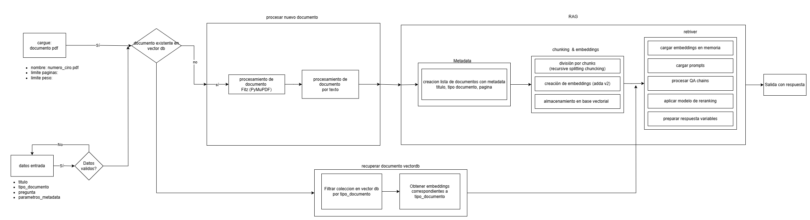
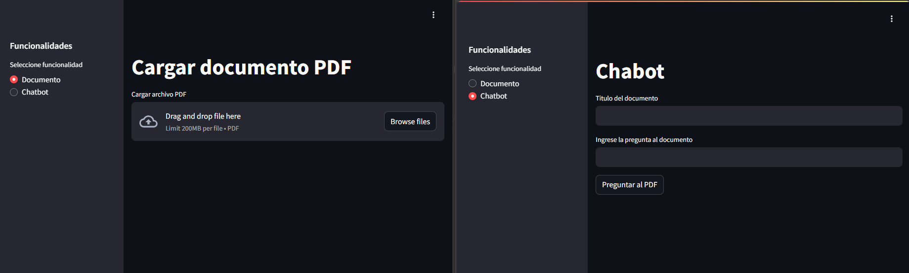
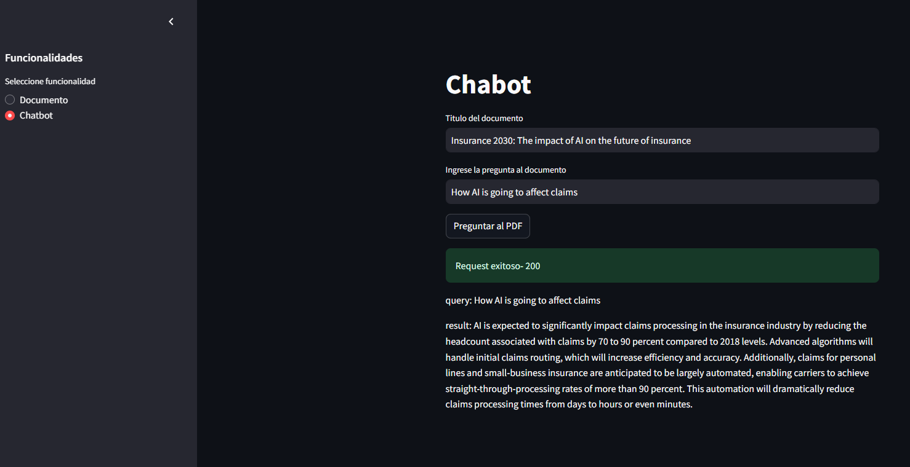
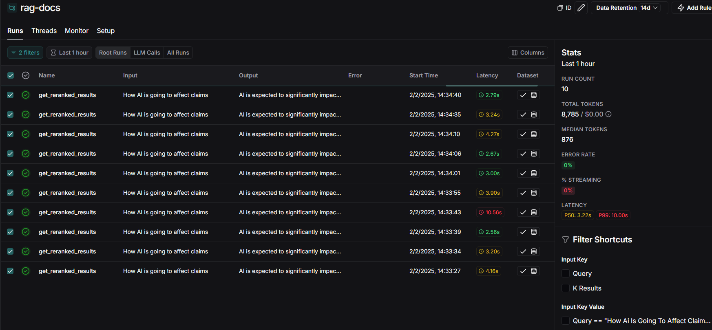
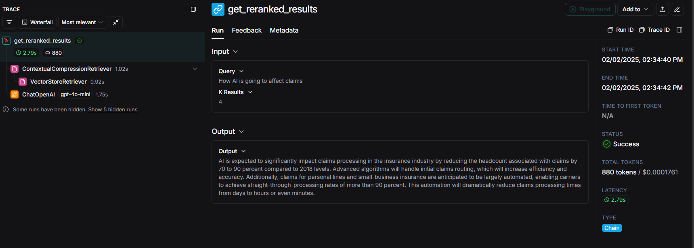
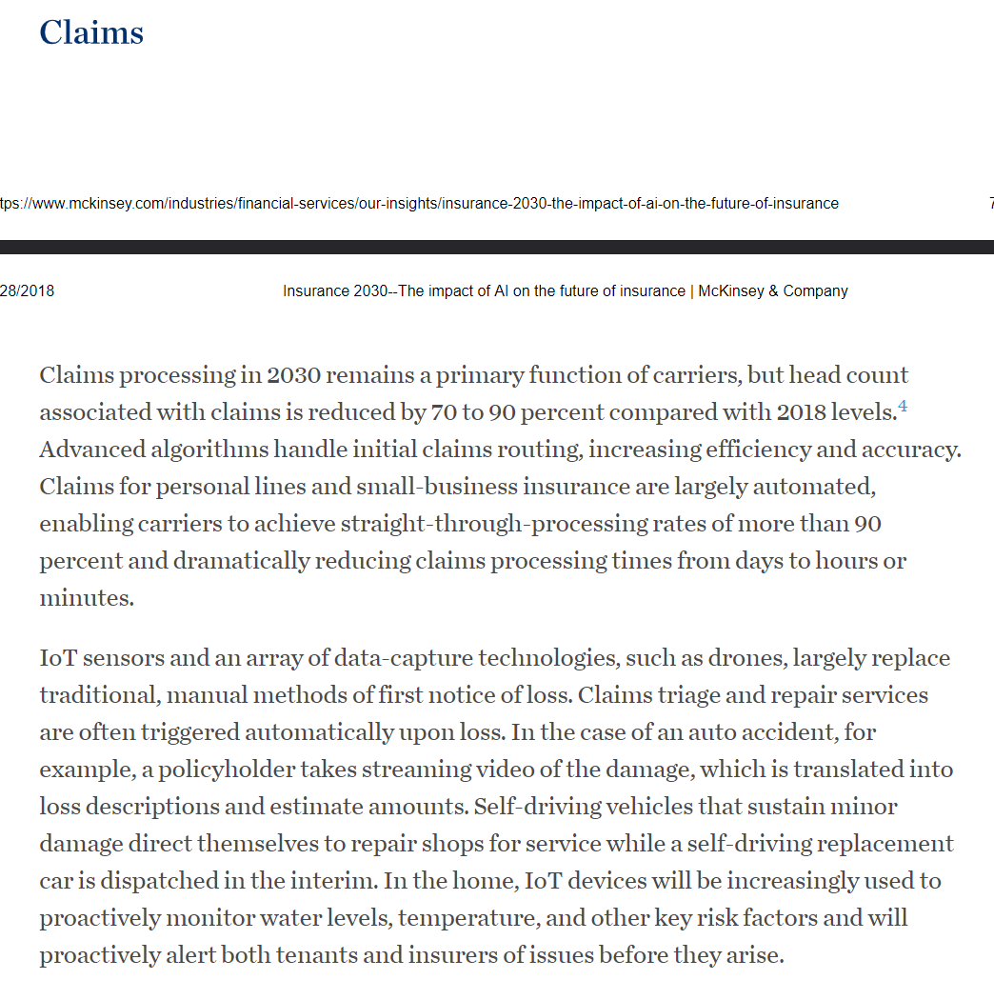

## RAG - DOCS

Realizado por: [Felipe Gonzalez Roldan](https://felipeg17.github.io/index.html)

### Generalidades
Se utilizó una estructura basada en RAG (Retrieval Augmented Generation), ya que permite combinar el conocimiento embebido en un gran modelo de lenguaje (LLM) con una base específica de datos, tal como el documento proporcionado.

Ventajas del RAG:
+ Escalable a soluciones empresariales
+ Manejo y preservación de la base de conocimientos específicos
+ Consumo bajo/moderado de tokens de LLMs

### Estructura

Para la solución implementada se utilizó `langchain`, el cual es uno de los *frameworks* más extendidos para el consumo programático de LLMs, además de brindar soporte e integración con una variedad de elementos como: servicios de IA, bases vectoriales, bases relacionales, entre otros.

Asimismo, proporciona facilidad cognitiva al integrar el *LCEL* que permite simplificar los flujos de interacción con modelos de IA usando secuencias conocidas como cadenas.

#### Arquitectura RAG

Se abordó una solución basada en *self-awareness RAG* con *reranking*. 

<p align="center">
  
</p>

Toda la arquitectura del RAG se encuentra incorporada en la  [clase Process Document](/app/procesar_documento/services/process_document.py).

#### Ingesta de documento

Se utiliza el paquete `PyMuPdf` también conocido como `fitz`, en términos generales es uno de los PDF *loaders* permitiendo hacer análisis detallado del documento, casi a nivel de componentes. Para esta aplicación se carga el documento en forma de *bytes* para facilitar la transferencia y evitar el almacenamiento local. Se utiliza el método `load_page().get_text()` para obtener el texto de cada página.

Luego se transforma el documento para ser ingestado en la base de datos vectorial en 3 pasos:

1. Extracción de metadata: Se crea una lista de *Documents* con metadata a nivel de página (título, página, tipo de documento, page_content), esta información es relevante para la búsqueda por metadata en la base vectorial.
2. Splitting y chunking: Se dividen cada uno de los *Documents* por una cierta cantidad de caracteres. Se utilizó la técnica de *recursive chunking* donde se trata de dividir cada fragmento usando un parámetro de ciertos caracteres procurando respetar saltos de línea y signos de puntuación. También se incorporó la alternativa de *semantic chunking* donde la partición de los textos se hace por similitud semántica. Como hiperparámetros se usó 800 caracteres de partición que equivale a casi media página de texto.
3. Creación de embeddings: Con el texto dividido se obtienen los *embeddings* que son la representación vectorial de los fragmentos de texto. Se utilizó el modelo de `ada-002` de openAI por su uso extendido.


#### Base vectorial

La base de la técnica RAG es el uso de *embeddings* almacenados en una base de datos vectorial. Los *embeddings* son un tipo especial de *transformer* que permite convertir un texto en una representación vectorial que conserva el contexto, el sentido semántico y el significado del texto. De esta manera se puede conservar la *idea* del lenguaje humano. Luego se puede comparar con otros fragmentos de texto y analizar la similitud entre significados. De este modo, al almacenar un documento de forma vectorial, se puede relacionar directamente una pregunta específica con el fragmento de texto que más se parezca de forma semántica, ya que se obtienen los *embeddings* de la pregunta y se comparan con los almacenados en la base vectorial. Generando así un sistema que responde de manera experta usando como referencia una base de conocimiento.

Para esta solución se optó por `chromadb` como base de datos vectorial teniendo como argumentos sus ventajas:

1. Opensource
2. Cliente basado en APIRest
3. Compatibilidad con múltiples formatos de embeddings.
4. Escalabilidad y compatibilidad con sistemas cloud
5. Persistencia de la información
6. Integración directa con Langchain
7. Filtrado por metadata y contenido

Se utilizó un cliente https de una base vectorial de `chroma` corriendo en un contenedor en la nube. Se utilizó la división por: 

- tenant: 'dev'
- database: 'rag-database'
- collection: 'rag-docs'

#### Cadena QA

Si bien la busqueda de información la base de conocimiento se puede hacer directamente a través de una pregunta y comparación semántica. Se obtienen mejores resultados utilizando una cadena QA. 
En este caso se tiene un LLMs de intermediario entre la pregunta y la respuesta, permitiendo mayor flexibilidad en la información recolectada. 

El método RAG, tiene un *Retriever* que consiste en el proceso de búsqueda en la base vectorial y el *Augmented Generation* se logra con un LLM, para está aplicación se seleccionó `gpt-4o-mini` por su bajo costo por token y los buenos resultados en benchmarks.

Se utiliza la clase `RetievalQA` que toma como parametros la instancia de la base vectorial, la pregunta realizada, la instancia del LLMs y el tipo de cadena (en este caso *stuff*). El conjunto de pasos es:

1. Se convierte la pregunta en embeddings
2. Se busca en la base vectorial los fragmentos de texto que sean más similares a la pregunta
3. A través de un prompt el LLMs toma como contexto la pregunta y la información recuperada de la base vectorial
4. El LLM prepara una respuesta basada en la información recuperada de la base vectorial.

**Nota:** El método *stuff* pasa como contexto toda la información recuperada de la base vectorial al LLM.

En la clase [clase Process Document](/app/procesar_documento/services/process_document.py) el método `get_answer_from_rag_qa` permite seguir realizar esta interacción con el documento. De este modo el LLM procurará responder con base a un conjunto de instrucciones declaradas en el prompt, y usará unicamente la información de la base vectorial, limitandose a un conocimiento experto, con un bajo margen de alucionaciones.

```python
# Prompt usado para la QAChain
"""
You are an assistant specialized in answering questions about documents.
Your task is to use the information provided in the context to answer
the question.
Instructions: 
  1. Answer the following question based on the information
  2. Do not include unsolicited information, do not make up data, do not 
  include recommendations outside of the provided context.

Context:
{context}
Question:
{question}
"""
```

#### Cadena Reranking

El método de recuperación de los fragmentos de texto ysu porterior uso por parte del LLM para generar la respuesta puede ser susceptible a errores de contexto, esto es, que el texto recuperado no sea útil para responder la pregunta. Para solventar esto se utiliza un LLM auxiliar que permite establecer y priorizar aquellos fragmentos que sean RELEVANTES para responder, ed decir, se encarga de filtrar y reorganizar la información recuperada, proceso conocido como *reranking*. El modelo utilizado para este procedimiento fue `cohere rerank-v3.5`, que presenta un costo por tokens relativamente bajo y permite tener mayor certeza del contexto usado para responder.

En la clase [clase Process Document](/app/procesar_documento/services/process_document.py) el método `get_reranked_results` permite seguir realizar el proceso de reranking. En general es el mismo procedimiento que la cadena QA, usando el mismo prompt, solo que se agrega una llamado al modelo de reranking que toma el Retrieval y filta los fragmentos de contexto y luego el LLM responde la pregunta filtrada con el contexto relevante.

#### Microservicio APIRest

Para que esta solución sea escalable se disponibilizo como microservicio usando `FastAPI`. Se definieron 2 secciones con diferentes *endpoints*.

1. **Health:** ruta: rag-docs/health, es un método *get* que permite verificar que el servicio se encuentré en línea.
2. **Procesar documentos**: 
  - **documento** ruta: rag-docs/api/v1/documento - método *post*, permite ingestar el documento a la base vectorial.
  ```python
  # payload
  {
    "title": "string", # titulo del documento
    "document_type": "documento-pdf", # tipo de documento
    "document_bytes": "string" # documento convertido en bytes tipo hexa
  }
  ```
  - **busqueda_bdv** ruta: rag-docs/api/v1/busqueda_bdv - método *post*, permite hacer preguntas directamente a la base vectorial, retorna una lista de *k_results* con los fragmentos de mayor similitud semantica con su escore de similitud.
  ```python
  # payload
  {
    "title": "string",
    "document_type": "documento-pdf",
    "query": "string", # pregunta al documentos
    "k_results": 4, # cantidad de fragmentos a retornar
    "metadata_filter": {} # filtro de metadata 
  }
  ```
  - **documento** ruta: rag-docs/api/v1/cadena_qa - método *post*, permite ejecutar cadenas QA a la base de conocmiento, retorna una lista con los resultados, el query, y las fuentes usadas para la cadena.
  ```python
  # payload
  {
    "title": "string",
    "document_type": "documento-pdf",
    "query": "string", # pregunta al documentos
    "k_results": 4, # cantidad de fragmentos a retornar
    "metadata_filter": {} # filtro de metadata 
  }
  ```
  - **documento** ruta: rag-docs/api/v1/cadena_rankeada - método *post*, permite ejecutar cadenas con reranking a la base de conocmiento, retorna un string con la respuesta a la pregunta.
  ```python
  # payload
  {
    "title": "string",
    "document_type": "documento-pdf",
    "query": "string", # pregunta al documentos
    "k_results": 4, # cantidad de fragmentos a retornar
    "metadata_filter": {} # filtro de metadata 
  }
  ```

Todo el servicio se organizó en la [carpeta](/app/) donde la API se estruturó bajo el patrón MVC (Model View Controller) separando los servicios a través de routers, permitiendo un desacople lógico entre ellos. Los endpoints se denominaron conforme a las especificaciones de OpenAPI, y los controllers de cada servicio invocan a una interfaz de la clase `ProcessDocument` para separar la lógica del servicio de su instanciación.

Si bien los modelos de lenguaje se pueden consumir directamente, esta opción de crear un *backend* especifico para la aplicación tiene múltiples ventajas:

- Despliegue directo en plataformas cloud
- Personalización de la lógica de negocio que se desee implementar con la aplicación
- Disponibilización como servicio a múltiples áreas
- Integración con otras aplicaciones

#### Observabilidad

Para analizar el desempeño del rag se utilizó la herramienta de `Langsmith`, la cual proporciona todo el seguimiento y ejecución de aplicaciones desarrolladas en Langachain.

Para esto se integró el *decorador* `@traceable` en los métodos de cadenas QA y cadena rankeada, de está manera cada vez que se invoquen estos métodos se puede tener trazas de la ejecución, recopilando datos claves como: el consumo de tokens, la latencia, la respuesta.

A través de `Langsmith` se puede realizar *experimentos* que permiten determinar métricas de desempeño de aplicaciones basadas en IA generativa. Cabe reasaltar que a diferencia de los modelos clásicos de IA, en el caso generativo es complejo tener certidumbre total en las respuestas, ya que muchas están sujetas a interpretación.

Como método para maximizar la conguencia de las respuesta se propone el uso del *reranking*, sin embargo, basado en el *RAG Triad* se pueden implementar dos métricas adicionales:

- **Correctness:** A tráves de un LLMs adicional se puede evaluar que la respuesta efectivamente de solución a la pregunta.

- **Groundness:** A través de otro LLMs se revise que la respuesta este basada en el contexto recuperado de la base de conocimiento.

Estas dos métricas se pueden automatizar, permitiendo que la evaluación se haga en escala masiva.

### Front

Se construyó un *front* basado en `streamlit` para interactuar con la aplicación. Todo el desarrollo se encuentra en la [carpeta](/front/) y el archivo de ejecución es `front.py` de la carpeta raíz.

<p align="center">
  
</p>

El front cuenta con dos páginas:
- Documento: Permite adjuntar un documento en .pdf e ingestarlo en la base vectorial llamando al servicio *rag-docs/api/v1/documento*.
- Chabot: Permite hacer preguntas especificas a la base de conocimiento a través del servicio *rag-docs/api/v1/cadena_rankeada*.

Una de las grandes ventajas de tener un *back* con la aplicación del RAG, es que se puede integrar separadamente, esto es, se puede llamar desde el front, se puede llmar desde otro servicio, confiriendole más escalabilidad.

**Vídeo funcionamiento:** [Prueba front](https://youtu.be/QYTdtVMn1cE)

### Pruebas

Para probar la aplicación se cargó el documento **Insurance 2030: The impact of AI on the future of insurance** a la base de conocimiento del RAG y se probó la pregunta *How AI is going to affect claims* por 10 ejecuciones.

<p align="center">
  
</p>

<p align="center">
  
</p>


Usando los **traces** de Langsmith se obtuvo:

| Función              | AVERAGE of latency (s) | AVERAGE of total_tokens |
|----------------------|---------------------|-------------------------|
| get_reranked_results | 4.04                | 878.50                  |

El tiempo de respuesta medio es de casi *4 segundos* lo que es perfectamente integrable en cualquier aplicación de respuesta rápida. La mayoria de respuestas estuvieron por debajo de los 3 segundos.

Respecto al consumo de tokens el promedio de consulta fue de 880 tokens por *trace*, lo que implica un costo de $0.0001761 USD, con esto se puede obtener una volumetría y estimar costos globales de consumo.

Todos los resultados se encuentran en el archivo [runs.csv](/resources/runs.csv).

<br>
<p align="center">
  
</p>

La respuesta en todos los casos fue:

```
AI is expected to significantly impact claims processing in the insurance industry by reducing the headcount associated with claims by 70 to 90 percent compared to 2018 levels. Advanced algorithms will handle initial claims routing, which will increase efficiency and accuracy. Additionally, claims for personal lines and small-business insurance are anticipated to be largely automated, enabling carriers to achieve straight-through-processing rates of more than 90 percent. This automation will dramatically reduce claims processing times from days to hours or even minutes.
```

Revisando la sección de la base de conocimiento, se observa que la respuesta es un resumen de la sección de *Claims*, por ende se puede concluir que la respuesta de la aplicación se basa en el contenido del documento, convirtiendolo en un agente especialista en dicha información.

<p align="center">
  
</p>


### Despliegue en la nube

Los desarrollos de esta aplicación se probaron en una EC2 de AWS. Se propone un archivo [Docker](/Dockerfile) el cual tiene contenerizado el backend desarrollado en FastAPI.

Para GCP se propone el uso de **Cloud Run**. Si el tráfico no es muy alto, con la imagen de Docker se puede hacer el despliegue de forma automática y por demanda. En caso de que requiera una instancia permanente, se puede usar el servicio de **Compute Engine** y desplegar una máquina tipo *e2-standard-2* basada en Linux. Se puede montar Docker y desplegar el servicio y al mismo tiempo el front en la misma instancia.

Para la base de datos vectorial se desplegó un contenedor de Docker basado en la [documentación](https://docs.trychroma.com/production/containers/docker#docker). Si se quiere tener el cliente de chroma como una base transversal a todos los desarrollos, se requeriría su ejecución en una máquina aparte. Dependiendo de la demanda, puede ser una *e2-standard-2* o una *e2-standard-4*.


